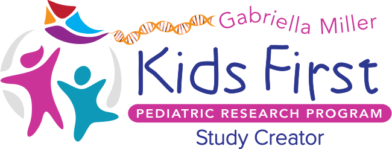

<p align="center">
  
</p>
<p align="center">
  <a href="https://github.com/kids-first/kf-api-study-creator/blob/master/LICENSE"></a>
  <a href="https://kids-first.github.io/kf-api-study-creator/"></a>
  <a href="https://circleci.com/gh/kids-first/kf-api-study-creator"></a>
  <a href="https://codecov.io/gh/kids-first/kf-api-study-creator"></a>
</p>

# Kids First Study Creator

Create studies and upload files for ingestion into the Kids First datamodel.

## Development Quick Start

To get started developing, bring up the service with docker compose:

```
# If you haven't already, create the kf-data-stack network
docker network create kf-data-stack

# Bring up the study creator API
docker-compose up
```

Some mock data will automatically be loaded upon starting for immediate use
of the api.

The graphql endpoint and GraphiQL interface is available at
http://localhost:5002/graphql

## Documentation

The below will build and auto-reload the documentation found within the
`docs/` directory:

```
sphinx-autobuild docs/ build -p 8000
```
