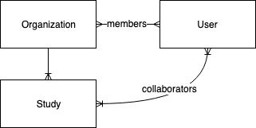

# Organizations

**Status:** Approved, waiting for implementation

An organization encompasses a group of people working together to integrate many studies.

## Why

The concept of an an Organization arises from the need to manage groupings of studies and people with similar tooling. With an Organization, an institution or data coordinating center can establish a workspace for itself and administer its own studies and personnel. An Organization is intended to separate administrative needs from the data collection process.

## How

An Organization encompasses two important entities: studies and users. An Organization owns many studies where each study is related strictly to one Organization. An Organization also contains many users although each user may be a member of many Organizations.

### Model

#### Diagram

#### Schema
These are fields to be set on the `Organization` model:
```graphql
type Organization {
  id: ID!
  name: String!
  description: String
  avatar: String
  email: String
  website: String
}
```

### Behavior

The following outlines use of Organizations as the user will experience them in the application.
If a user logs in but is new or does not yet belong to any organizations, they will be prompted to create a new Organization or given guidance on getting access to an existing organization (see 'Joining').
If a user belongs to one or more organizations, they will be presented with the dashboard for their last active organization.

#### Creating
Upon creation, the authenticated user who made the request to create the Organization will be added as an administrative member of the Organization.
##### Schema
```graphql
type CreateOrganizationInput {
  name: String!
}
createOrganization(input: CreateOrganizationInput): Organization!
```
##### Permissions

Any authenticated user may create a new organization.

#### Updating
An Organization may be updated to modify some of its properties.
##### Schema
```graphql
type UpdateOrganizationInput {
  name: String!
  description: String
  avatar: String
  email: String
  website: String
}
updateOrganization(input: UpdateOrganizationInput): Organization!
```
##### Permissions

Any administrative user within an Organization may update basic fields about the Organization.

#### Joining

Members of an Organization will be added by administrative members of the Organization primarily through invites. For users being added that do not yet have an account, an email will be sent with a link to sign-up and immediately be added to the Organization. Users that are already on the platform may be added immediately through look up.
> Allowing Organization administrators to look up users on the platform may be a security risk and may need to be left out in favor of only using email invites.

An invite may be sent with the following mutation:
```graphql
type ReferralTokenInput {
  email: String!
  organization: ID!
  studies: [ID]
  groups: [ID]
}
createReferralToken(input: ReferralTokenInput): ReferralToken!
```

## Changes
### Query and Mutation Context
Introducing Organizations requires many queries and mutations to be updated to add the desired Organization to the context. For example, the `allStudies` query for administrative users will need to be updated:
```diff
- allStudies(name: String): StudyNode!
+ allStudies(name: String, organization: ID!): StudyNode!
```
```diff
- Study.objects.filter(deleted=False).all()
+ organization = Organization.objects.get(organization_id)
+ Study.objects.filter(deleted=False, organization=organization).all()
```
### Permissions
Broad permission groups such as `Administrators` and `Investigators` are applied application-wide. These scopes will be too large with the introduction of Organizations. Permissions will likely need to be controlled per-Organization such as a user being Administrator in Organization A but only Investigator in Organization B. This will require some refactor of the permissions mechanism.  

