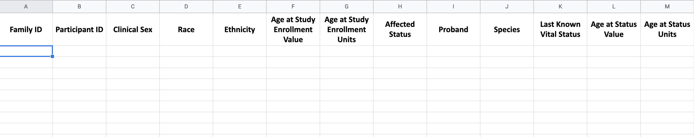
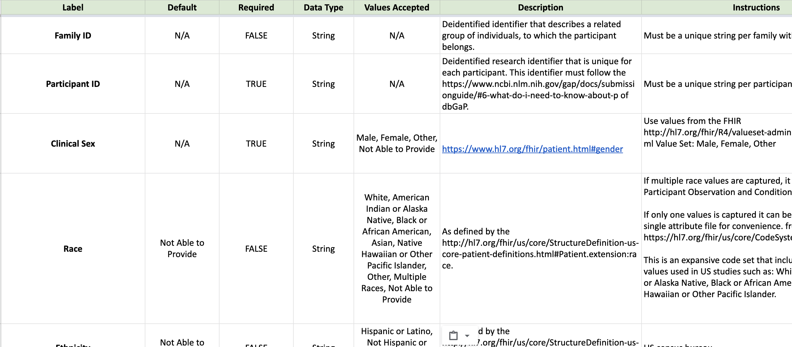
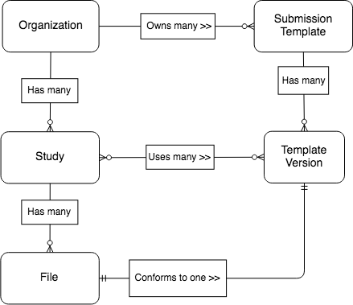
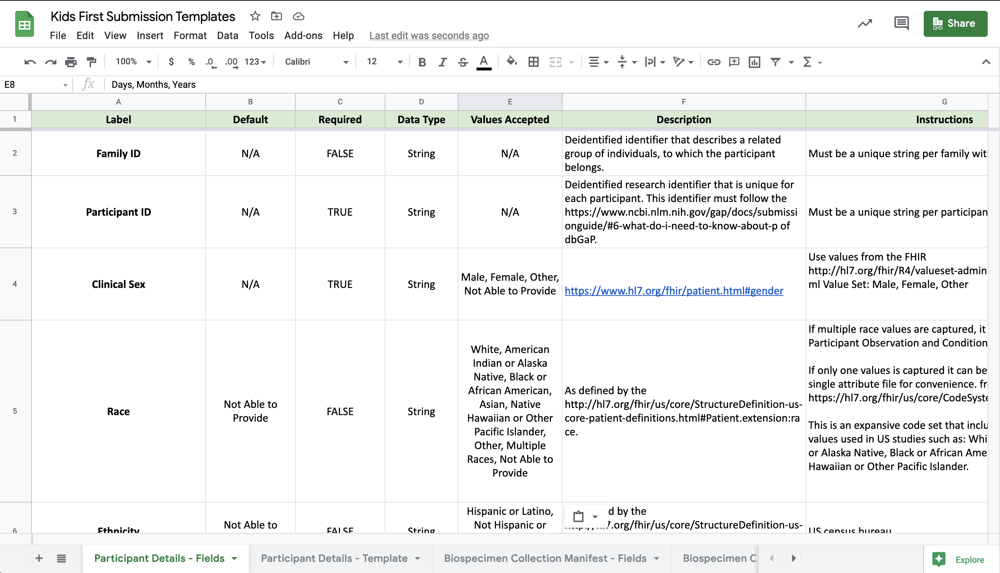

# 🗃 Data Submission Templates

**Status**: Approved, waiting for implementation

## 💡 Motivation

As the Kids First DRC handles a wide variety of disease types and research studies,
we have been fairly flexible over the years with accepting a plethora of formats
with fairly loose requirements on the submission for clinical data.

This approach made it easy for investigators whose studies had already completed
to retroactively submit their data to the DRC. However, it often elongated
the clinical data validation and review process with manual work
since every study had a different set of files and formats that had to be
interpreted, cleaned, and validated.

This experience has motivated a submission mechanism that is standardized
across studies and enables automated data validation.

## 📝 Definition

The phrase "data submission template" describes two things:

### Template Submission File

A tabular file that conforms to a standard format and
has an associated set of submission rules for populating it.



### Template Field Definitions

The submission rules, encoded as a set of fields where each field describes
things like: column name, column type, values accepted,
instructions for populating values, etc.



Each template typically describes submission standards for a particular entity
(e.g. participant disease event) and each row in the tabular submission file
represents one instance of that entity (e.g. cleft lip observed for PT1 at 400 days since birth).

## 👪 Sharing

Templates should be easy to reuse across organizations/studies.
This is important because oftentimes organizations/studies will have such similar data
collection requirements that they may want to reuse existing templates
rather than create their own templates.

Sharing templates can pose some management challenges. What happens if Study A
is using Templates [T1, T2, T3], but Study B from a different organization wants to
change template T3 and use it?

We need a way to ensure a study that is using a particular template
is not affected by any changes being made to the template.

We can achieve this through template versioning.

## #️⃣ Versioning

Templates are often worked on collaboratively by multiple people and go through
several iterations. Even when templates have been implemented and submitters
begin using them, they inevitably require changes. This is because the
submission templates represent a window into the data model which they
populate, and the data model often changes over time.

We could track the provenance of templates by versioning them when they're
released or approved for use.

### Version the Set 📦

If versioning were implemented, we would likely want to release and version a set of
templates together rather than individually since the set effectively
represents a data model. When we version data model changes we typically
assign a version to the whole model even if only one entity in the model changed.

This approach is used in versioning FHIR models as well. You can read about
the motivation [here](https://www.devdays.com/wp-content/uploads/2019/03/DD18-EU-Martijn-Harthoorn-FHIR-Packages-and-Versioning-2018-11-16.pdf)
which explains why versioning the set is so important.

### Use [Semantic Versioning](https://semver.org/)

Semantic versions (numbers in the form of `X.Y.Z` ) make it easy to compare
two sets of data and understand their relative recency. The versioning rules
are out of scope for this document but here are some examples as to how
versioning might work:

-   Add new template -> major version change (1.0.0)
-   Add/remove/change column in existing template -> minor version change (1.1.0)
-   Change template description, instructions -> patch version change (1.0.1)

## 👉 MVP

The rest of this document describes a potential MVP solution for submission
templates. Other solutions have been detailed [here](templates_solutions.md),
including a long term solution which incorporates concepts like template packages
and template releases through template package versioning.

## 👮 Template Management Rules

1. A DataTemplate / TemplateVersion may be created at any time
2. A DataTemplate / TemplateVersion may be updated/deleted if it is not being used
   in any study
3. A new TemplateVersion may be assigned to a study at any time

## 📓 Model



### DataTemplate

Represents the "essence" of the template (like File does with Version). Also
provides a container for different versions of the template, allowing us
to capture the provenance of the templates.

#### Database Table Schema

| Name         | Type        | Description                                                                |
| ------------ | ----------- | -------------------------------------------------------------------------- |
| id           | varchar     | A human friendly identifier (Kids First style) for the submission template |
| name         | varchar     | Short name for submission template                                         |
| description  | text        | A short blurb describing the entity the submission template represents     |
| icon         | varchar     | The name of the Font Awesome icon to use when displaying the template      |
| created_at   | datetime    | Timestamp of creation                                                      |
| modified_at  | datetime    | Timestamp of update                                                        |
| creator      | foreign key | Foreign key to User that created the submission template                   |
| organization | foreign key | Foreign key to Organization that owns the template package                 |

#### Django Model Schema

| Name                          | Type           | Description                                 |
| ----------------------------- | -------------- | ------------------------------------------- |
| All fields in DB table schema |
| template_versions             | RelatedManager | List of template versions this template has |

### TemplateVersion

A `TemplateVersion` is a container for the tabular submission file
(`submission_template_file`) and associated submission rules
(`field_definitions`).

See **[Template Fields](0003_template_fields_mvp.md#🗃-template-fields)** for details on the
template field specifications.

#### Database Table Schema

| Name              | Type        | Description                                                                                                                                                                                        |
| ----------------- | ----------- | -------------------------------------------------------------------------------------------------------------------------------------------------------------------------------------------------- |
| id                | varchar     | A human friendly identifier (Kids First style) for the submission template                                                                                                                         |
| description       | text        | A short blurb describing this version of the template                                                                                                                                              |
| field_definitions | JSON        | The template submission rules. A JSON blob with a standard structure which will encode the template field objects having things like: label, key, description, type, values_accepted, instructions |
| created_at        | datetime    | Timestamp of creation                                                                                                                                                                              |
| modified_at       | varchar     | Timestamp of update                                                                                                                                                                                |
| creator           | foreign key | Foreign key to User that created the submission template                                                                                                                                           |

#### Django Model Schema

| Name                          | Type           | Description                                                                                            |
| ----------------------------- | -------------- | ------------------------------------------------------------------------------------------------------ |
| All fields in DB table schema |
| released                      | BooleanField   | A computed field (not stored in db) denoting whether the template is being used in one or more studies |
| extract_config_file           | FileField      | Reference to the actual extract config file in a storage system                                        |
| studies                       | RelatedManager | List of studies this template version is assigned to                                                   |

## ✨ Creating Templates

### CreateDataTemplateMutation

Creates a DataTemplate and initial TemplateVersion

```graphql
type CreateDataTemplateInput {
    name: String!
    organization: ID!
    description: String!
    icon: String
}
```

### CreateTemplateVersionMutation

Creates a TemplateVersion and adds it to a DataTemplate

```graphql
type CreateTemplateVersionInput {
    dataTemplate: ID!
    description: String!
    fieldDefinitions: JSONString!
}
```

### (Optional) CloneTemplateMutation

Creates a new DataTemplate and a TemplateVersion by duplicating the
referenced template version and it's data template. Overwrites the name,
description, and organization of the source Template with the supplied values
in the cloned Template.

```graphql
type CloneTemplateInput {
    templateVersion: ID!
    name: String!
    description: String!
    organization: ID
}
```

### Permissions

-   Any organization administrator may create or clone DataTemplates/TemplateVersions

## 🛠 Modifying Templates

### UpdateDataTemplateMutation

```graphql
type UpdateDataTemplateInput {
    name: String
    description: String
    organization: ID
}
```

### UpdateTemplateVersionMutation

```graphql
type UpdateTemplateVersionInput {
    description: String
    fieldDefinitions: JSONString
    studies: [ID]
}
```

### Permissions

-   Any organization administrator may update a DataTemplate or
    TemplateVersion if their organization owns it

## 🔗 Assigning Templates to Studies

Add/remove template versions to/from studies

### LinkTemplatesToStudiesMutation

```graphql
type LinkTemplateToStudyInput {
    templateVersions: [ID]!
    studies: [ID]!
}
```

### Permissions

-   Any organization or study administrator may assign a TemplateVersion to a
    study they have access to

## 🗑 Deleting Templates

### DeleteDataTemplateMutation

```graphql
type DeleteDataTemplateInput {
    id: ID!
}
```

### DeleteTemplateVersionMutation

```graphql
type DeleteTemplateVersionInput {
    id: ID!
}
```

### Permissions

-   Any organization administrator may delete a DataTemplate or
    TemplateVersion if their organization owns it

## 📦 Downloading Templates

### Files

#### Template Field Definitions

A TSV file that will be generated from the `TemplateVersion.field_definitions` JSON.
This file will contain a template's field definitions. Since the field definitions
include instructions for populating each field in the submission template, this file
essentially serves as user guidance.


#### Template Submission File

A TSV file that will be generated from the `TemplateVersion.field_definitions`.
This is the file that people will fill out and use to submit data to their study.


### Download Study Templates

Probably the easiest way to download templates since it could bundle everything
into an archive or multi-sheet excel workbook for download.

```
/download/study/<Study.kf_id>/templates
```



### Download Latest Template

Download the latest TemplateVersion of a DataTemplate.

```
/download/template/<Template.id>
```

You would get an archive with two files pertaining to the latest `TemplateVersion`:

-   Template field definitions - see definitions above
-   Template submission file - see definitions above

### Download a Template Version

Download a specific TemplateVersion of a DataTemplate.

```
/download/template/<Template.id>/versions/<TemplateVersion.id>
```

You would get an archive with two files pertaining to a specific `TemplateVersion`:

-   Template field definitions - see definitions above
-   Template submission file - see definitions above

### Permissions

-   Any user may download template files

## Changes to Existing Functionality

-   A `Study` will have a new field, `Study.template_versions`, a many to many
    relationship to `TemplateVersion`.
-   The `File.file_type` field will be replaced by a one to one foreign key
    to a `TemplateVersion`. The `TemplateVersion` must be one of
    templates in the Study's template versions.
-   The study and file mutations should be updated accordingly as well

## 💻 Implementation Considerations

When thinking about implementing data submission templates, we should consider
the entire development, test, and documentation lifecycle and some of the
common painpoints encountered as they may inform a better implementation of our
templates.

### Single Source of Truth

A change in my template definition (e.g. new column) should not cause a
cascading set of manual changes that need to be made in several other
related artifacts.

For example, if I add a new column to the Participant Diseases template,
I need to ensure that the following are also updated to reflect the change:

-   Template documentation / end-user guidance
-   Test data generators in template unit tests
-   Code that maps the human friendly column names to standard concepts
    (currently encoded in the Extract Config)

Ideally, we should have a single source of truth for the template
definitions and everything else should be generated from this definition. This
would eliminate human errors when making updates to various artifacts and
alleviate a lot of unecessary development and test effort related to template
changes.
