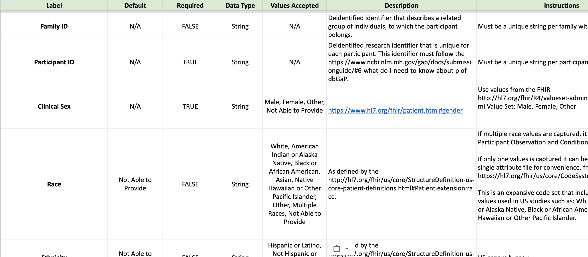

# 🗃 Template Field Definitions

**Status**: Approved, waiting for implementation

This document entails the specifications for template field definitions. Specifically:

-   Components that define a field
-   Encoding field definitions
-   Template files generation from field definitions
-   Field validation (just an intro)

## Background

The phrase **"data submission template"** describes two things:

### Template Submission File

A tabular file that conforms to a standard format and
has an associated set of submission rules for populating it.


### Template Field Definitions

The submission rules, encoded as a set of fields where each field describes
things like: column name, column type, values accepted,
instructions for populating values, etc.



## Example Field Definitions

Field definitions are stored in `TemplateVersion.field_definitions`. Each
object in `fields` contains the definition for one field (i.e. column) in the
template.

```json
{
    "fields": [
        {
            "key": "CONCEPT.PARTICIPANT.ID",
            "label": "Participant ID",
            "required": true,
            "default": null,
            "data_type": "string",
            "description": "",
            "instructions": "Unique string that must exist in Participant Details"
        },
        {
            "key": "CONCEPT.PARTICIPANT.SEX",
            "label": "Clinical Sex",
            "required": true,
            "default": "Not Able to Provide",
            "data_type": "string",
            "description": "",
            "accepted_values": [
                "Male",
                "Female",
                "Other",
                "Not Able to Provide"
            ],
            "instructions": "Please follow guidelines for https://www.hl7.org/fhir/valueset-administrative-gender.html"
        }
    ]
}
```

## Encoding

-   The field definitions will be encoded as a JSON document with an expected
    structure
-   This structure will be validated/enforced in the backend API, using
    [json-schema](https://json-schema.org/)

## Expected Structure

```json
"$schema": "https://json-schema.org/draft/2020-12/schema",
"$id": "https://example.com/product.schema.json",
"title": "Schema for Template Field Definitions",
"description": "JSON schema for validating template field definitions",
"type": "object",
"properties": {
    "fields": {
        "description": "The list of template field definitions",
        "type": "array",
        "items": {
            "type": "object",
            "additionalProperties": false,
            "required": [
                "label",
                "description"
                "required",
                "default",
                "data_type",
                "accepted_values",
            ],
            "properties": {
                "key": {
                    "type": ["string", "null"],
                    "description": "Canonical name for the field"
                },
                "label": {
                    "type": "string",
                    "description": "Human friendly name for field"
                },
                "description": {
                    "type": ["string"],
                    "description": "Description of the field"
                },
                "required": {
                    "type": "boolean",
                    "description": "Whether the field is required to be populated in data that claims to conform to the template"
                },
                "default": {
                    "description": "The default value to use if the field is not required and empty"
                },
                "data_type": {
                    "type": "string",
                    "description": "The data type of the field value",
                    "enum": ["string", "number", "boolean", "date"]
                },
                "accepted_values": {
                    "type": ["array", "null"],
                    "description": "The range of acceptable values for the field. Set to null if this field can accept any value"
                }
            }
        }
    }
},
"required": ["fields"],
"additionalProperties": false

}
```

## Components of a Field Definition

### `label`

-   The field label is the human friendly name of the field
-   Will be used as the column name for a column in the generated template
    submission file
-   Will be inserted in the generated template field definitions file

### `key`

-   The canonical name for the field label or column name
-   Will be used when validating submitted data files

The field's `key` helps us reliably translate the field's label to a standard
semantic identifier that can later be processed programmatically during
validation.

Templates from different organizations will often collect the same piece of
information and each use a different column name for that piece of information.

Keys can help us have a shared understanding of these columns and consequently
allow us to do some standard validation of data across all studies.

For example:

| Ogranization | Template                | Column Name | Key            | Related Validation Rule                 |
| ------------ | ----------------------- | ----------- | -------------- | --------------------------------------- |
| Kids First   | participant_details.tsv | person_id   | PARTICIPANT.ID | SPECIMEN.ID has max of 1 PARTICIPANT.ID |
| Kids First   | participant_details.tsv | specimen_id | SPECIMEN.ID    | SPECIMEN.ID has max of 1 PARTICIPANT.ID |
| NCI          | subject_information.tsv | Subject id  | PARTICIPANT.ID | SPECIMEN.ID has max of 1 PARTICIPANT.ID |
| NCI          | subject_information.tsv | Sample id   | SPECIMEN.ID    | SPECIMEN.ID has max of 1 PARTICIPANT.ID |

**How keys are defined and discovered is out of scope for this RFC.**
**This will be covered in a future RFC relating to validation.**

### `description`

-   Describes the purpose of the field
-   Will be inserted in the generated template field definitions file

### `required`

-   Whether a value for this field is required or not
-   If a field is required, it must be present in a file that claims to conform
    to the template AND a non-empty value must be supplied for it.
-   Will be inserted in the generated template field definitions file
-   Will be used when validating submitted data files

### `default`

-   The default value to use if the field is not required AND the value is empty
-   Will be inserted in the generated template field definitions file
-   Will be used when validating submitted data files

### `data_type`

-   The expected data type of the field value after coercion. Must be one of:

```
string
number
boolean
datetime (??)
```

-   Will be inserted in the generated template field definitions file
-   Will be used when validating submitted data files

### `accepted_values`

-   The range of acceptable values for the field
-   If null, then all values will be accepted
-   If not null, then field values must take on one of the values in the accepted list
-   Will be inserted in the generated template field definitions file
-   Will be used when validating submitted data files

### `instructions`

-   Detailed instructions or notes for the data submitter on how to populate this field
-   Will be inserted in the generated template field definitions file

## Field Validation

**NOTE: This a complex topic and will be detailed in a separate RFC**

When we talk about "data validation" it is important to define exactly what
that means since it is a vague term with different interpretations.

Please see the [validation slides](https://docs.google.com/presentation/d/1Qb425xdqGt0VKlCO81edyCzlCqohm94J1QwxxGd2ajY/edit?usp=sharing)
for more details and examples on validation.

Some types of validation are basic (e.g. are all required columns present) and can be
done on a single data file without knowledge of the other data files in a submission,
while other types of more complex validation require evaluating all data files
in a submission.

### Basic

In the first iteration of templates, validation will be very basic
focusing on validation of a single submitted data file at a time.

A user should be able to upload a data file, select which template they think
it conforms to (or it could get auto-assigned based on column presence), and
then click a button to validate the file for the following:

1. Are all required columns present?
2. Does every record in a required column have a non-empty value?
3. For any columns that have an `accepted_values` restriction, do all values
   take on a value from that list
4. Do all values in a column have the expected data type post coercion?

### Complex

More complex data validation often requires the prequisite of proper
cleaning/wrangling of data (e.g. strip whitespace, best-effort correction of typos).
This can be messy and often requires complicated wrangling logic. Examples:

-   Check that age values are HIPAA compliant
-   Check ontology code strings are correctly formatted for different ontologies
-   Validate a field value based on values from other fields for the same record/row

Additionally, some types of complex validation required knowledge of all of the
data files in a submission. Examples:

-   Check uniqueness and consistency of values for a field across all files
    (e.g. "male" vs "Male" vs "M")
-   Validate relationship between different fields across all files
    (e.g. all specimen ID values link to only one unique participant ID value)

See [See Submission Workflow](https://docs.google.com/presentation/d/1Qb425xdqGt0VKlCO81edyCzlCqohm94J1QwxxGd2ajY/edit?usp=sharing)
for details on a possible MVP validation solution that covers both basic
and complex validation.

## API Details

```python

class TemplateVersion:

    def validate_field_definitions(self):
        """
        Use json schema to validate the field_definitions structure and content
        """
        pass

    @property
    def field_definitions_dataframe(self):
        """
        Create a dataframe from the field_definitions JSON that will become the
        content of the field definitions file when the user requests
        to download the template
        """
        pass

    @property
    def submission_dataframe(self):
        """
        Create a dataframe from the field_definitions JSON that will become the
        content of the template submission file when the user requests
        to download the template
        """
        pass

def load_field_definitions(filepath_or_buffer, **kwargs):
    """
    Load field definitions from a tabular file or file buffer
    Will be used in the mutation that uploads field definition files from the
    user

    - Load file content into DataFrame
    - Do best-effort error correction to make fields compliant with schema
    - Convert to DataFrame to JSON and validate field definitions against
    the field definitions schema
    """
    pass
```

```python
# creator/data_templates/views.py

def download_template_version(request, template_version_id):
    """
    For specific template version, generate the template field definitions file
    and the submission file
    Zip up above files into archive OR insert into multi-sheet excel workbook

    Return archive content in HTTP response
    """
    pass

def download_latest_template(request, data_template_id):
    """
    For latest version of a data template, generate the template field definitions
    file and the submission file
    Zip up above files into archive OR insert into multi-sheet excel workbook

    Return archive content in HTTP response
    """

def download_study_templates(request, study_id):
    """
    For all templates assigned to a study, generate the template field definitions
    file and submission file for each template
    Zip up above files into archive OR insert into multi-sheet excel workbook

    Return archive content in HTTP response
    """
    pass
```
