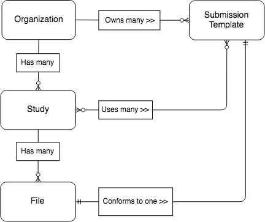
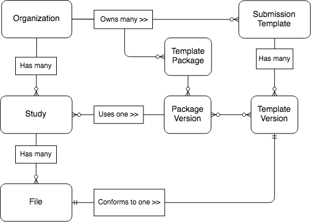

# Templates Solution Comparison

The purpose of this document is to outline the primary use cases for
submission templates and walk through potential solutions for the most common
use case. Complexity, pros, and cons will be described for each solution.

Hopefully this can help us decide how we want to implement data
submission templates, MVP and beyond.

## Use Cases

1. The same template is needed by multiple studies for data submission
2. A new template needs to be added to a study's existing templates to capture a new kind of data
3. A template is deprecated and needs to be removed from a study so submitters stop using it
4. An existing study template needs to be changed for that study (e.g. add col, remove col, rename col, change col type)

## Most Common Use Case (4)

1. CHOP admin creates initial templates:

    ```
    Participant Demographics (PDE)
    Biospecimen Collection Manifest (BCM)
    ```

2. CHOP team iterates on development of [`PDE`, `BCM`] until they're happy with
   first draft of templates

3. CHOP admin assigns [`PDE`, `BCM`] to [`Study-CBTN`, `Study-A`] for use

4. Data submitters begin using [`PDE`, `BCM`] to upload files to `Study-CBTN` and `Study-A`

5. Changes to `BCM` (add col, remove col, rename a col) are needed for `Study-CBTN` but not `Study-A`

## Solution 1: Templates

### Model



### Implementation

1. Create Templates

    ```
    Templates
    ---------
    PDE, BCM
    ```

2. Add Templates to studies:

    ```
    Study-CBTN.templates = [PDE, BCM]
    Study-A.templates = [PDE, BCM]
    ```

... People start using templates

... Changes are required to BCM

3. Copy `BCM` -> `BCM_V1`, Update `BCM_V1` with desired changes

    ```
    Templates
    ---------
    PDE, BCM, BCM_V1
    ```

4. Replace `BCM` with `BCM_V1` in CBTN

    ```
    Study-CBTN.templates = [PDE, BCM_V1]
    Study-A.templates = [PDE, BCM]
    ```

### Template Management Rules

1. A Template may be created and added to a study at any time
2. A Template may be updated/deleted if it is not being used in any study
3. A Template may be assigned to a study at any time

### Permissions

1. Any organization admin may create Templates
2. Any organization admin may update/delete a Template owned by their organization
3. Any organization or study admin may assign Templates to a study they have access to

### Pros/Cons

-   ✅ Simplest and quicket to implement now
-   ✅ Templates are shareable among studies
-   ❌ Google drive problem - proliferation of template copies with different names to capture versions
-   ❌ No way to programmatically track provenance of templates
-   ❌ May become tedious to add/remove/change individual templates to studies when there are many studies
    and/or many templates
-   ❌ No easy way to track or capture a batch of template updates. All updates are captured as individual template
    versions.
-   ❌ Would make implementing a template release process infeasible due to lack of versioning
-   ⚠️ Might be tricky to introduce templates with versions later

## Solution 2: Templates with Versions

### Model


1. Create Templates with initial TemplateVersions

    ```
    Templates
    ---------
    PDE, BCM

    TemplateVersions
    -----------------
    PDE.template_versions = [PDE.v1]
    BCM.template_versions = [BCM.v1]
    ```

2. Add TemplateVersions to studies:

    ```
    Study-CBTN.templates_versions = [PDE.v1, BCM.v1]
    Study-A.templates.template_versions = [PDE.v1, BCM.v1]
    ```

... People start using templates

... Changes are required to BCM

3. Create new version for template `BCM` -> `BCM.v2`, update `BCM.v2` with desired changes

    ```
    Templates
    ---------
    PDE, BCM

    TemplateVersions
    -----------------
    PDE.template_versions = [PDE.v1]
    BCM.template_versions = [BCM.v1, BCM.v2]
    ```

4. Replace `BCM.v1` with `BCM.v2` in `Study-CBTN`

    ```
    Study-CBTN.templates_versions = [PDE.v1, BCM.v2]
    Study-A.templates_versions = [PDE.v1, BCM.v1]
    ```

### Template Management Rules

1. A Template / TemplateVersion may be created at any time
2. A Template / TemplateVersion may be updated/deleted if it is not being used in any study
3. A TemplateVersion may be assigned to a study at any time

### Permissions

1. An organization admin may create Template/TemplateVersions
2. An organization admin may update/delete TemplateVersions owned by their organization
3. An organization or study admin may assign TemplateVersions to a study they have access to

### Pros/Cons

-   ✅ Templates are easily shareable among studies
-   ✅ Can reliably/programmatically track provenance of templates
-   ✅ Studies are not affected by non-relevant template updates
-   ❌ May become tedious to add/remove/change individual templates to studies when there are many studies
    and/or many templates
-   ❌ No easy way to track or capture a batch of template updates since all updates are captured as individual template
    versions
-   ⚠️ UI design and frontend implementation won't be as trivial as Solution 1

## Solution 3: Templates with Versions and Packages with Versions

### Model



1. Create Templates with initial TemplateVersions

    ```
    Templates
    ---------
    PDE, BCM

    TemplateVersions
    -----------------
    PDE.template_versions = [PDE.v1]
    BCM.template_versions = [BCM.v1]
    ```

2. Create a TemplatePackage for CHOP organization

    ```
    Packages
    ---------
    CHOP_PCK
    ```

3. Create initial PackageVersion with TemplateVersions:

    ```
    Packages
    ---------
    CHOP_PCK

    PackageVersions
    -----------------
    CHOP_PCK.package_versions = [CHOP_PCK.v1]

    CHOP_PCK.v1.template_versions = [PDE.v1, BCM.v1]
    ```

4. Add PackageVersion to studies

    ```
    Study-CBTN.package_versions = [CHOP_PCK.v1]
    Study-A.package_versions = [CHOP_PCK.v1]
    ```

... People start using templates

... Changes are required to BCM

5. Create new version for template `BCM` -> `BCM.v2`

    ```
    Templates
    ---------
    PDE, BCM

    TemplateVersions
    -----------------
    PDE.template_versions = [PDE.v1]
    BCM.template_versions = [BCM.v1, BCM.v2]
    ```

6. Create a new package version

    ```
    Packages
    ---------
    CHOP_PCK

    PackageVersions
    -----------------
    CHOP_PCK.package_versions = [CHOP_PCK.v1, CHOP_PCK.v2]

    CHOP_PCK.v1.template_versions = [PDE.v1, BCM.v1]
    CHOP_PCK.v2.template_versions = [PDE.v1, BCM.v2]
    ```

7. Assign new package version to CBTN

    ```
    Study-CBTN.package_versions = [CHOP_PCK.v2]
    Study-A.package_versions = [CHOP_PCK.v1]
    ```

### Template Management Rules

1. A Template / TemplateVersion may be created at any time
2. A Template / TemplateVersion may be updated/deleted if it is not being used in any study
3. A TemplatePackage / PackageVersion may be created at any time
4. A PackageVersion may be assigned to a study at any time
5. TemplateVersions may be added/updated/deleted in a TemplatePackage via
   creating a new PackageVersion with the desired TemplateVersions

### Permissions

1. Any organization admin may create Template/TemplateVersions
2. Any organization admin may add TemplateVersions to a Package owned by their organization
3. Any organization admin may update/delete TemplateVersions owned by their organization
4. Any organization or study admin may assign PackageVersions to a study they have access to
5. Any organization admin may update a TemplatePackage owned by their organization

### Package Versioning (Semantic Versions)

Automatically generatig a semantic version number for the template package
version is difficult. Automatic semantic versioning requires an agreed upon
set of rules by all organizations that are creating template packages.
Even if the example rules below were used to generate semantic version numbers,
the backend needs to understand package updates at a deep level of granularity
in order to generate meaningful semantic version numbers.

We would most likely want to use these rules as guidelines or standards and
allow users to update the semantic version number of their package.

#### Major Version Updates

1. Add a new template (new Template) to the template package to capture a new type of data
1. Delete a template from the template package

#### Minor Version Updates

1. Add a new template version (new TemplateVersion) with field schema updates to
   an existing template within the package

#### Patch Version Updates

1. Add a new template version (new TemplateVersion) with basic info updates
   to an existing template within the package

### Pros/Cons

-   ✅ Templates are easily shareable among studies
-   ✅ Can reliably/programmatically track provenance of templates
-   ✅ Studies are not affected by non-relevant template updates
-   ✅ Easier to manage a set of logically related templates and add to multiple studies
-   ✅ Easier to track / capture a batch of template updates using template package versions
-   ⚠️ UI design and frontend implementation becomes considerably more complex
-   ⚠️ Backend implementation becomes considerably more complex
