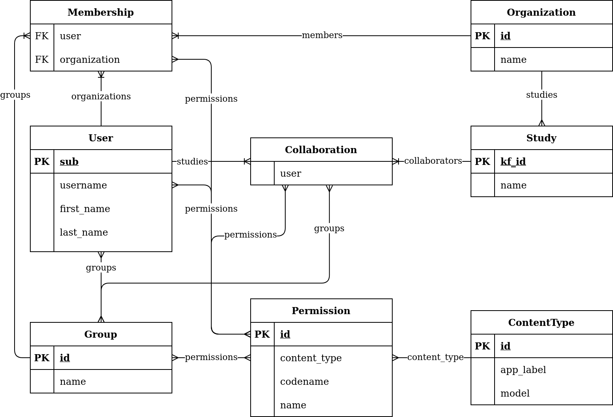

# Permissions
> RFC XXXX
**Status:** Approved, waiting for implementation

Permissions are vital to allowing a large array of users within the application. As the structure of the application has become more sophisticated, the need for additional user management functionality beyond that of Django's default has arisen. This document outlines how users are granted access to various actions within the application.

## Why

The concept of organizations introduces another level of structure and thus requires an additional level of permissions. For example, most users will only be allowed to operate within organizations which they are a part of.
Some of these users may be allowed to invite other users to the organization, change details about the organization, or only be allowed basic access to the organization and some of its studies. These are all grants that work on the level of the organization.
Grants such as adding new documents, starting data reviews, or creating data releases are performed in the context of individual studies. These grants are both user and study specific where a user may be able to perform one action in a certain study but not in another.

## Terminology

It’s useful to have standard terms when referring to relationships between users and organizations or studies.

*Users* are general consumers of the application.

*Members* are users who belong to an organization.

*Collaborators* are users who belong to a study.

A *user* is a *member* of one or more organizations who *collaborates* on one
or more studies in that organization.

## Organization Member Roles

Each member of an organization will be assigned exactly one role within that organization.
The member’s role will determine actions that they may perform at the organizational level.
A user may have a different role for each organization that they are a member of.
The initial set of Organization Member roles are:

- Member - The default role for users in an organization, may view the organization and any studies that they collaborate on
- Manager - May see all studies in the organization and invite or remove members of the organization or collaborators of studies
- Administrator - May perform the same actions as the Manager and also edit organizational info and delete studies or the organization itself

### Examples of Member Permissions

These are some permissions that may be included in member roles:

- Edit Organization details
- Invite new member
- Remove member
- Delete Organization

## Study Collaborator Permissions

Each collaborator of a study will be assigned a set of permissions per-study. This will determine what actions the user may perform in the context of that study.

Unlike organizations and the current approach, permissions will not be assigned by a proxy such as a group or role. This means that there will a very large

### Examples of Collaborator Permissions

These are some permissions that may be included in a collaborator's permissions for a study:

- Upload document
- Start data review
- Create release
- Invite collaborator

## Implementation



The new organization and study permissions will extend the existing Django permission model by tieing permission groups to the through tables that relate users to studies and organizations.


### Permission Checks

There will be three permission checks in total on the `User` model:

```python
def has_perm(perm: str) -> bool
def has_org_perm(org: Organization, perm: str) -> bool
def has_study_perm(study: Study, perm: str) -> bool
```

`has_perm()` will not be used unless we need to have varying levels of
application-wide permissions. For the most part, all users will have the same
application level permissions with perhaps only superusers having an exception.

`has_org_perm()` will be used to check for organization-level permissions. It
will assert a user has a specified permission on their organization membership
either directly or through a group. It requires an organization to be passed
so that the desired membership may be found.

`has_study_perm()` will be used to check for study-level permissions. This check
will assert that a user has a specified permission on their study collaboration
either directly or through a group. It requires a study object to be passed to
reconcile which collaboration to check permissions for.
